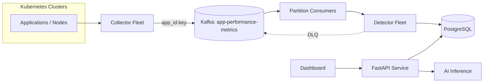

# Robust Microservice and Cluster-Based AIOps Platform

Kubernetes-native AIOps platform for detecting, explaining and recommending
remediation for application and cluster anomalies across many Kubernetes
clusters and thousands of applications. Telemetry is collected directly from the
Kubernetes API; no external metrics backend is required.

## Architecture



Data flow: collectors discover workloads and emit a normalized event schema to a
partitioned Kafka topic keyed by `app_id`. A consumer group reads those
partitions, forwards batches to the detector fleet, which applies configurable
rules, fingerprints anomalies and writes deduplicated incidents to PostgreSQL.
The FastAPI service serves processed incidents and health to the dashboard and
invokes the AI inference service on demand. The API is never in the raw-metrics
path.

## Services

| Service | Port | Responsibility |
| --- | --- | --- |
| `collectors/` | 9100 | Kubernetes API discovery + normalization, Kafka producer |
| `kafka/` | 9092 | Topic provisioning, producer/consumer helpers (shared library) |
| `consumers/` | 9150 | Kafka consumer group, rebalancing, offsets, DLQ routing |
| `detectors/` | 9200 | Detection rules, fingerprint dedup, incident lifecycle |
| `database/` | 5432 | SQLAlchemy models + repository (shared library) |
| `api/` | 8000 | Incident/health/status APIs for the dashboard |
| `inference/` | 9300 | Grounded AI analysis, 4-model failover |
| `dashboard/` | 8501 | Streamlit UI |

## Repository structure

```
collectors/   Kubernetes + simulated collection, normalization
kafka/        topic provisioning, producer, consumer helpers
consumers/    partition consumer service
detectors/    rules, fingerprints, detector fleet service
api/          FastAPI service
database/     ORM models, session, repository
inference/    model router, prompts, inference service
models/       shared Pydantic schema (event + incident contract)
config/       settings, structured logging, self-monitoring metrics
dashboard/    Streamlit dashboard
deployment/   Docker Compose notes, Kubernetes manifests, RBAC
tests/        unit tests
```

## Run locally

```bash
cp .env.example .env      # set NVIDIA_API_KEY
docker compose up --build
```

Dashboard: http://localhost:8501 · API: http://localhost:8000/docs · Collector:
http://localhost:9100/status · Consumer: http://localhost:9150/status ·
Detector: http://localhost:9200/status · Inference: http://localhost:9300/status.

Scale the fleet:

```bash
docker compose up -d --scale collector=3 --scale consumer=4 --scale detector=4
```

The collector defaults to `COLLECTOR_MODE=simulated` so the stack runs end to end
without a cluster. Set `COLLECTOR_MODE=k8s` (and mount a kubeconfig or run
in-cluster with the provided RBAC) to collect real Kubernetes telemetry.

## Event schema

Every collector emits the same normalized event, keyed by `app_id`:

```json
{
  "cluster_id": "cluster-a", "collector_id": "collector-1", "app_id": "app-cluster-a-014",
  "namespace": "ns-cluster-a", "pod": "app-cluster-a-014-3", "timestamp": "2026-09-23T09:00:00+00:00",
  "metric_type": "pod_cpu", "metrics": {"usage_cores": 0.95, "limit_cores": 1.0, "ratio": 0.95},
  "labels": {"team": "team-4", "tier": "api", "kind": "workload"}
}
```

Collected metric types: `pod_cpu`, `pod_memory`, `node_cpu`, `node_memory`,
`pod_status`, `container_restarts`, `deployment_replicas`, `resource_limits`,
`node_condition`, `k8s_event`.

## Detection and incident lifecycle

Rules (`detectors/rules.py`) cover CPU saturation, memory saturation, container
restart storms, deployment degradation, unavailable replicas, node resource
exhaustion, abnormal resource growth and prolonged unhealthy pod states. All
thresholds are configurable (`THRESH_*`).

The incident fingerprint is `sha1(app_id | anomaly_type | metric)` — a stable
identity, deliberately not time-bucketed. Repeated observations of the same active
anomaly update the existing incident (`NEW` -> `ONGOING`, incrementing
`observation_count` and keeping the earliest `first_detected`), so Kafka retries
and detector restarts cannot create duplicates. A partial unique index on
`fingerprint` where `status <> 'RESOLVED'` enforces this in PostgreSQL. Incidents
with no observation inside `INCIDENT_RESOLVE_AFTER_SECONDS` are swept to
`RESOLVED`; a later recurrence opens a new incident.

Stored per incident: incident ID, application ID, cluster ID, detector ID, Kafka
partition, anomaly type, symptom metric, severity, evidence, first/last detected,
status, fingerprint, AI analysis, remediation and timestamps.

## AI inference

The API gathers the incident, its evidence and recent history and calls the
inference service. The inference service proposes only what the evidence supports
(explanation, evidence, root-cause hypotheses, remediation, confidence,
next diagnostic action) and cannot invent telemetry.

Model routing (`inference/router.py`) uses a **sticky active model** across
`NVIDIA_MODELS` (default `glm-5-3, glm-5-3-flash, kimi-k3, muse-glimmer-30b`).
The active model is retried `MODEL_FAILURE_THRESHOLD` times (default 3). Only
after all three trials fail is it marked unhealthy and the next model selected; a
model that keeps succeeding is never switched away from. Set the exact NVIDIA
model IDs in `NVIDIA_MODELS` if your account exposes different names.

## API endpoints

`GET /summary`, `GET /incidents`, `GET /anomalies/current`,
`GET /incidents/{id}`, `GET /incidents/{id}/timeline`, `GET /incidents/history`,
`GET /applications/health`, `GET /clusters/health`, `GET /detectors/status`,
`GET /kafka/health`, `GET /collectors/health`, `POST /incidents/{id}/analyze`,
`GET /health`, `GET /metrics`.

## Reliability and scalability

- Horizontal scaling by adding collector replicas, Kafka partitions and
  consumer/detector replicas; Kafka reassigns partitions automatically on
  rebalance.
- Producer configured for `acks=all`, idempotent delivery, batching, compression
  and retries; consumers commit offsets only after acknowledgement.
- Bounded retries with dead-letter routing for poison batches; backpressure via
  consumer batching and poll limits.
- Graceful shutdown on lifespan cancellation; structured JSON logging; health
  endpoints on every service.
- Dependency-free self-monitoring at `/metrics` (JSON) on collectors, consumers,
  detectors, the API and inference — no external metrics backend involved.

## Tests

```bash
pip install -r requirements.txt pytest
pytest -q
```

Covers detection rules, fingerprinting, incident dedup/lifecycle/idempotency, and
the 4-model failover policy.
